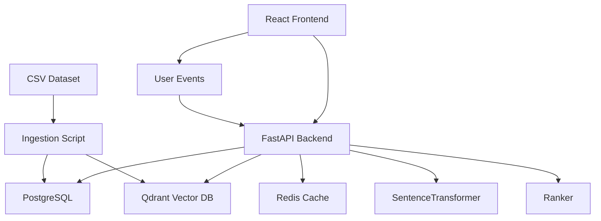

# EliteRec: Hybrid Product Recommendation System

EliteRec is an experimental full-stack product recommendation system built as a polished college/project demo. It combines a modern web UI, a FastAPI backend, a relational database, a vector database, caching, user-event tracking, and hybrid recommendation logic.

The project is designed to show how a real recommendation platform works end to end:

```text
Product catalog + user events
        ->
Embeddings + vector search
        ->
Ranking + diversity
        ->
Personalized recommendations
        ->
Frontend demo dashboard
```

This is not intended to be an over-engineered production SaaS. The goal is to deliver an impressive, understandable, and working recommendation engine demo that can be presented, explained, extended, and evaluated.

---

## Table of Contents

1. [Project Highlights](#project-highlights)
2. [What This Project Does](#what-this-project-does)
3. [Live Demo Features](#live-demo-features)
4. [Tech Stack](#tech-stack)
5. [Architecture](#architecture)
6. [Recommendation Pipeline](#recommendation-pipeline)
7. [Repository Structure](#repository-structure)
8. [Quickstart With Docker](#quickstart-with-docker)
9. [Demo Workflow](#demo-workflow)
10. [API Endpoints](#api-endpoints)
11. [Frontend Overview](#frontend-overview)
12. [Data Ingestion](#data-ingestion)
13. [Demo Users](#demo-users)
14. [Analytics Dashboard](#analytics-dashboard)
15. [Configuration](#configuration)
16. [Development Commands](#development-commands)
17. [Testing And Verification](#testing-and-verification)
18. [Troubleshooting](#troubleshooting)
19. [Future Improvements](#future-improvements)
20. [Project Summary](#project-summary)

---

## Project Highlights

- Full-stack recommendation system with backend, frontend, database, cache, and vector search.
- Personalized product recommendations based on user interaction history.
- Similar-product recommendations using semantic embeddings.
- Trending recommendations using product popularity and rating signals.
- Real-time event tracking for clicks, views, and purchases.
- Demo-friendly React dashboard with live metrics and explanation panels.
- Docker Compose setup for FastAPI, Postgres, Redis, Qdrant, and React.
- Flexible architecture that can later support arbitrary CSV datasets.
- Clean educational structure suitable for college project presentation.

---

## What This Project Does

EliteRec recommends products to users using a hybrid strategy.

It can:

- Load a product catalog from CSV.
- Store product data in PostgreSQL.
- Generate semantic product embeddings with SentenceTransformers.
- Store vectors in Qdrant.
- Track user interactions such as views, clicks, and purchases.
- Recommend products personalized to a user.
- Recommend products similar to a selected product.
- Show globally trending products.
- Display live project analytics.
- Explain recommendations in simple human-readable language.

Example:

```text
User clicks Bluetooth speakers
        ->
System stores interaction
        ->
User profile is built from recently clicked item titles
        ->
Qdrant finds semantically similar products
        ->
Ranker sorts candidates
        ->
Frontend shows "Picked for You"
```

---

## Live Demo Features

The React frontend includes:

- **Project dashboard**
  - total products
  - demo users
  - total interactions
  - active recommendation strategy

- **Personalized recommendations**
  - different recommendations per selected demo user
  - updates after click/purchase events

- **Trending recommendations**
  - based on bought-in-last-month, reviews, stars, and best-seller flag

- **Search**
  - search catalog items by product title

- **Product detail modal**
  - product image
  - category
  - price
  - rating
  - explanation text
  - add-to-cart interaction signal

- **How It Works section**
  - explains the pipeline: Track -> Embed -> Retrieve -> Rank

---

## Tech Stack

### Backend

- FastAPI
- SQLAlchemy
- Pydantic
- PostgreSQL
- Redis
- Qdrant
- SentenceTransformers
- XGBoost-style ranker wrapper
- NumPy / Pandas / Scikit-learn

### Frontend

- React
- Vite
- Tailwind CSS
- Framer Motion
- Axios
- Lucide React icons

### Infrastructure

- Docker
- Docker Compose
- Postgres container
- Redis container
- Qdrant container
- FastAPI container
- React/Vite container

### ML / Recommendation Methods

- Semantic embeddings
- Vector search
- Heuristic ranking fallback
- Maximal Marginal Relevance diversity reranking
- Trending score
- Interaction-based personalization

---

## Architecture



### Main Services

| Service | Purpose |
|---|---|
| Frontend | Demo UI for search, recommendations, analytics, and product modals |
| FastAPI | API routes and recommendation orchestration |
| Postgres | Stores users, items, and interactions |
| Redis | Caches recommendation responses |
| Qdrant | Stores and searches semantic product vectors |
| Ingestion script | Loads CSV products into Postgres and Qdrant |

---

## Recommendation Pipeline

### 1. Product Ingestion

The CSV catalog is read, cleaned, embedded, and stored.

```text
CSV
 -> clean rows
 -> save products in Postgres
 -> generate SBERT embeddings
 -> save vectors in Qdrant
```

### 2. User Event Tracking

Frontend actions send events to the backend.

Supported event types:

```text
view
click
purchase
```

These interactions create a user history.

### 3. Personalized Recommendations

For a user:

1. Fetch recent item history from Postgres.
2. Embed recent product titles.
3. Mean-pool embeddings into a user profile vector.
4. Query Qdrant for similar products.
5. Remove products already in the user's history.
6. Rank candidates.
7. Apply diversity reranking.
8. Return recommendations.

### 4. Similar Product Recommendations

For a selected product:

1. Embed the product title.
2. Search Qdrant for similar vectors.
3. Remove the seed product itself.
4. Return similar products.

### 5. Trending Recommendations

Trending uses this scoring idea:

```text
0.55 * log(bought_in_last_month + 1)
+ 0.25 * stars
+ 0.15 * log(reviews + 1)
+ 0.05 * best_seller_flag
```

This creates a simple but effective global fallback.

---

## Repository Structure

```text
product-recommendation-system/
  README.md
  app.py
  hybrid_recommender.py
  collaborative_filtering.py
  universal_wrapper.py
  evaluation.py
  run_pipeline.py
  persistence.py
  artifacts/
  universal_artifacts/

  recommender_platform/
    app/
      main.py
      api/
        analytics.py
        events.py
        items.py
        recommendations.py
        users.py
      core/
        cache.py
        config.py
      db/
        models.py
        session.py
      ml/
        engine/
          hybrid.py
        ranking/
          ranker.py
        evaluation/
          metrics.py
      schemas/
        recommendation.py
      services/
        llm.py
        recommender.py

    scripts/
      ingest_data.py
      seed_demo_users.py
      seed_interactions.py
      docker-teardown.sh

    frontend-react/
      src/
        App.jsx
        main.jsx
        index.css
      package.json
      vite.config.js

    data/
      amz_uk_processed_data.csv

    docs/
      ADVANCED_PROJECT_ANALYSIS_AND_ROADMAP.md
      DOCKER_ENGINE_FIX.md
      project_handoff_documentation.md

    Dockerfile
    docker-compose.yml
    Makefile
    requirements.txt
```

### Important Files

| File | Description |
|---|---|
| `recommender_platform/app/main.py` | FastAPI app entrypoint |
| `recommender_platform/app/services/recommender.py` | Core recommendation orchestration |
| `recommender_platform/app/ml/engine/hybrid.py` | Embeddings, Qdrant search, MMR |
| `recommender_platform/app/ml/ranking/ranker.py` | Ranking feature logic |
| `recommender_platform/scripts/ingest_data.py` | CSV ingestion into Postgres + Qdrant |
| `recommender_platform/scripts/seed_demo_users.py` | Seeds named demo users |
| `recommender_platform/frontend-react/src/App.jsx` | Main React demo UI |
| `universal_wrapper.py` | Prototype for future flexible CSV support |

---

## Quickstart With Docker

### 1. Go To The Platform Folder

```bash
cd recommender_platform
```

### 2. Create Local Environment File

```bash
cp .env.example .env
```

### 3. Start Core Services

```bash
docker compose up -d --build db qdrant redis api frontend
```

First startup can take time because Python ML dependencies and the SBERT model are large.

### 4. Ingest Product Data

If the database is empty:

```bash
make ingest
```

Equivalent command:

```bash
docker compose run --rm api python scripts/ingest_data.py --csv /app/data/amz_uk_processed_data.csv --sample-size 25000 --reset
```

### 5. Seed Demo Users

```bash
make seed-demo
```

This creates named demo users with different interaction histories.

### 6. Open The App

Frontend:

```text
http://127.0.0.1:5173
```

API docs:

```text
http://127.0.0.1:8000/docs
```

API readiness:

```text
http://127.0.0.1:8000/health/ready
```

---

## Demo Workflow

Use this flow when presenting the project.

### Step 1: Open The Frontend

```text
http://127.0.0.1:5173
```

Show:

- project dashboard cards
- live product count
- interaction count
- recommendation strategy

### Step 2: Explain The Pipeline

Use the "How It Works" section:

```text
Track -> Embed -> Retrieve -> Rank
```

### Step 3: Show Trending Products

Explain that trending works even for new users.

### Step 4: Switch Demo Users

Use the user dropdown:

```text
Speaker Fan
Tech Buyer
Budget Shopper
Home Setup
Live Demo User
```

Show how recommendations change.

### Step 5: Search Products

Try searches like:

```text
echo
speaker
anker
sony
bluetooth
```

### Step 6: Open Product Modal

Click a product card and show:

- image
- price
- rating
- recommendation explanation

### Step 7: Add To Cart

Click "Add to Cart" to create a stronger interaction signal.

### Step 8: Refresh / Switch User

Show that interactions are stored and can influence recommendations.

---

## API Endpoints

### Health

```http
GET /health
```

Returns basic API health.

```http
GET /health/ready
```

Returns whether recommendation components are loaded.

Example:

```json
{
  "status": "ready",
  "engine_loaded": true,
  "ranker_loaded": true
}
```

### Items

```http
GET /api/v1/items/?limit=20&offset=0
```

List products.

```http
GET /api/v1/items/?q=echo&limit=8
```

Search products by title.

```http
GET /api/v1/items/{asin}
```

Get a product by ASIN.

### Users

```http
POST /api/v1/users
```

Create or fetch a user.

Body:

```json
{
  "external_id": "USER_0"
}
```

```http
GET /api/v1/users/{external_id}/history?limit=20
```

Fetch recent user history.

### Events

```http
POST /api/v1/events
```

Track a user event.

Body:

```json
{
  "user_id": "USER_0",
  "asin": "B09B96TG33",
  "type": "click"
}
```

Supported types:

```text
view
click
purchase
```

### Recommendations

```http
GET /api/v1/recommend/trending?limit=8
```

Get globally trending products.

```http
GET /api/v1/recommend/user/USER_0?limit=5
```

Get personalized recommendations for a user.

```http
GET /api/v1/recommend/item/B09B96TG33?limit=5
```

Get products similar to a seed item.

```http
GET /api/v1/recommend/bundle/B09B96TG33?limit=5
```

Get simple bundle-style recommendations.

### Analytics

```http
GET /api/v1/analytics/summary
```

Returns live dashboard statistics.

Example:

```json
{
  "total_products": 5120,
  "total_users": 101,
  "total_interactions": 1027,
  "top_category": {
    "name": "CD, Disc & Tape Players",
    "count": 2632
  },
  "most_interacted_product": {
    "asin": "B08YF1T4SW",
    "title": "Sony SRS-XB13...",
    "category": "Hi-Fi Speakers",
    "count": 17
  },
  "active_strategy": "SBERT + Qdrant retrieval, XGBoost-style ranking fallback, MMR diversity"
}
```

---

## Frontend Overview

The frontend is located at:

```text
recommender_platform/frontend-react/
```

Main file:

```text
recommender_platform/frontend-react/src/App.jsx
```

The frontend:

- fetches personalized recommendations
- fetches trending products
- fetches analytics summary
- creates users automatically
- tracks product clicks
- tracks add-to-cart as purchase signal
- searches product catalog
- opens product detail modal
- displays recommendation explanations

### Frontend API Configuration

In development:

```text
VITE_API_BASE=/api/v1
```

When running with Docker Compose, the browser can also call:

```text
http://127.0.0.1:8000/api/v1
```

The Vite proxy is configured with:

```text
VITE_PROXY_API=http://api:8000
```

This matters inside Docker because `127.0.0.1` inside the frontend container is not the API container.

---

## Data Ingestion

The current product dataset is:

```text
recommender_platform/data/amz_uk_processed_data.csv
```

The ingestion script:

```text
recommender_platform/scripts/ingest_data.py
```

It performs:

1. CSV streaming.
2. Row cleaning.
3. Invalid row filtering.
4. Postgres upsert by ASIN.
5. SBERT embedding generation.
6. Qdrant vector upsert.

Run ingestion:

```bash
cd recommender_platform
make ingest
```

Useful options:

```bash
docker compose run --rm api python scripts/ingest_data.py \
  --csv /app/data/amz_uk_processed_data.csv \
  --sample-size 5000 \
  --batch-size 128 \
  --reset
```

### Why Qdrant?

Qdrant stores vectors and allows fast semantic search.

Instead of matching only exact words, it can find products with similar meaning.

Example:

```text
"portable bluetooth speaker"
```

can match:

```text
"wireless outdoor speaker"
"compact soundcore speaker"
"waterproof bass speaker"
```

---

## Demo Users

Demo users are seeded with:

```bash
make seed-demo
```

The script:

```text
recommender_platform/scripts/seed_demo_users.py
```

Current demo users:

| User ID | UI Label | Intended Behavior |
|---|---|---|
| `USER_0` | Speaker Fan | Speaker/audio recommendations |
| `USER_1` | Tech Buyer | Echo/smart-device style recommendations |
| `USER_2` | Budget Shopper | Portable/budget item recommendations |
| `USER_3` | Home Setup | Home/wireless/stereo recommendations |
| `CODEx_SMOKE_USER` | Live Demo User | Testing/demo interaction user |

---

## Analytics Dashboard

The project includes a simple live analytics endpoint and UI cards.

Metrics:

- total products
- total users
- total interactions
- top category
- most interacted product
- active recommendation strategy

This makes the project easier to present because the audience can see that the system has real data behind it.

---

## Configuration

Environment template:

```text
recommender_platform/.env.example
```

Important variables:

```env
APP_ENV=development
API_PORT=8000

POSTGRES_USER=admin
POSTGRES_PASSWORD=secretpassword
POSTGRES_DB=recommender_db
POSTGRES_HOST=db
POSTGRES_PORT=5432
DATABASE_URL=postgresql://admin:secretpassword@db:5432/recommender_db

QDRANT_HOST=qdrant
QDRANT_PORT=6333

REDIS_HOST=redis
REDIS_PORT=6379

SBERT_MODEL=all-MiniLM-L6-v2
INGEST_SAMPLE_SIZE=25000
INGEST_BATCH_SIZE=128
CACHE_TTL=120
RANKER_MODEL_PATH=

GROQ_API_KEY=
GEMINI_API_KEY=
USE_LLM_RERANKING=false

FRONTEND_PORT=5173
VITE_API_BASE=http://127.0.0.1:8000/api/v1
VITE_PROXY_API=http://api:8000
```

### LLM Note

The project works without LLM keys.

For a stable college demo, keep:

```env
USE_LLM_RERANKING=false
```

The app already provides deterministic fallback explanations, so the demo does not depend on Groq or Gemini.

---

## Development Commands

Run from:

```bash
cd recommender_platform
```

### Start Backend Stack

```bash
make up
```

### Ingest Products

```bash
make ingest
```

### Seed Demo Users

```bash
make seed-demo
```

### Start Full Watch Mode

```bash
make watch
```

### Start Frontend Locally

```bash
make frontend
```

### View Logs

```bash
make logs
```

### Stop Services

```bash
make down
```

### Stop And Remove Volumes

```bash
make down-v
```

### Emergency Docker Teardown

```bash
make teardown
make teardown-v
```

---

## Testing And Verification

### Backend Syntax Check

```bash
python3 -m py_compile \
  recommender_platform/app/main.py \
  recommender_platform/app/api/analytics.py \
  recommender_platform/app/services/recommender.py
```

### Frontend Build Check

```bash
cd recommender_platform/frontend-react
npm run build
```

### Manual API Smoke Test

```bash
curl http://127.0.0.1:8000/health
curl http://127.0.0.1:8000/health/ready
curl "http://127.0.0.1:8000/api/v1/items/?limit=3"
curl "http://127.0.0.1:8000/api/v1/recommend/trending?limit=3"
curl "http://127.0.0.1:8000/api/v1/analytics/summary"
```

### Test Event Tracking

```bash
curl -X POST "http://127.0.0.1:8000/api/v1/events" \
  -H "Content-Type: application/json" \
  -d '{"user_id":"USER_0","asin":"B09B96TG33","type":"click"}'
```

### Test Personalized Recommendations

```bash
curl "http://127.0.0.1:8000/api/v1/recommend/user/USER_0?limit=5"
```

### Test Frontend Proxy

```bash
curl "http://127.0.0.1:5173/api/v1/analytics/summary"
```

---

## Troubleshooting

### API Takes Time To Start

The API loads SentenceTransformers during startup.

First startup can be slow because the model may download from Hugging Face.

Check readiness:

```bash
curl http://127.0.0.1:8000/health/ready
```

### API Is Running But Recommendations Fail

Check API logs:

```bash
cd recommender_platform
docker compose logs -f api
```

Common reasons:

- Qdrant collection not created yet.
- Products not ingested.
- SBERT model still loading.
- Redis or Qdrant container not running.

### Product List Is Empty

Run:

```bash
make ingest
```

Then:

```bash
make seed-demo
```

### Frontend Proxy Returns 502

Inside Docker, Vite must proxy to:

```text
http://api:8000
```

Check:

```env
VITE_PROXY_API=http://api:8000
```

### Docker Compose Down Hangs

See:

```text
recommender_platform/docs/DOCKER_ENGINE_FIX.md
```

Then try:

```bash
make teardown
```

or:

```bash
make teardown-v
```

### LLM Errors In Logs

The project does not require LLM providers.

For stable demo:

```env
USE_LLM_RERANKING=false
GROQ_API_KEY=
GEMINI_API_KEY=
```

---

## Flexible CSV Vision

A strong future upgrade is to make EliteRec accept any CSV.

Current ingestion expects Amazon-style columns such as:

```text
asin
title
categoryName
price
stars
reviews
imgUrl
productURL
```

The future flexible version should map arbitrary CSV columns into a standard internal schema:

```text
id
title
category
price
rating
image_url
description
product_url
```

Example input datasets:

| Dataset Type | Possible Columns |
|---|---|
| Products | `product_id`, `name`, `category`, `price`, `rating` |
| Movies | `movie_id`, `title`, `genre`, `vote_average`, `poster` |
| Books | `isbn`, `book_title`, `author`, `rating`, `cover` |
| Courses | `course_id`, `name`, `subject`, `level`, `rating` |

The repo already contains a prototype:

```text
universal_wrapper.py
```

That file explores:

- schema auto-discovery
- column mapping
- optional features
- plug-and-play recommendation fitting

This is an excellent next step if the project needs a unique "game changing" feature.

Recommended future flow:

```text
Upload CSV
 -> preview columns
 -> auto-suggest mapping
 -> confirm mapping
 -> normalize rows
 -> embed text
 -> store in Postgres + Qdrant
 -> recommend
```

---

## Future Improvements

For a college project, the most valuable next improvements are:

### 1. Universal CSV Upload

Allow the user to upload any CSV and map columns.

This would turn the project from:

```text
Amazon product recommender
```

into:

```text
Universal CSV recommendation engine
```

### 2. Better Demo Data Personas

Create more seeded users:

- gaming user
- music user
- smart home user
- budget shopper
- premium shopper

### 3. Simple Evaluation Page

Add metrics:

- Precision@K
- Recall@K
- diversity score
- coverage

### 4. Visual Recommendation Explanation

Show score components:

- semantic similarity
- rating
- popularity
- category match

### 5. CSV Upload UI

Add frontend page:

```text
Upload -> Preview -> Map Columns -> Ingest -> Recommend
```

### 6. More Event Types

Track:

- search query
- search result click
- product view
- add to cart
- purchase

### 7. Screenshots / Demo GIF

Add screenshots to the README:

- dashboard
- personalized recommendations
- search
- product modal
- API docs

---

## What To Avoid For This Project

Since this is an experimental/college-level project, avoid spending too much time on:

- Kubernetes
- advanced CI/CD
- multi-tenant SaaS isolation
- billing
- enterprise auth
- production-grade observability
- complex model registry
- perfect ranking accuracy

Those are useful for a real product, but not necessary for an excellent project demo.

Focus instead on:

- working demo
- clean UI
- clear explanation
- flexible idea
- reliable recommendations
- strong README

---

## Project Summary

EliteRec demonstrates a complete recommendation system in a compact and understandable way.

It includes:

- product ingestion
- vector embeddings
- vector search
- ranking
- diversity reranking
- event tracking
- personalized recommendations
- trending recommendations
- analytics dashboard
- polished frontend
- Dockerized local environment

The current project is best described as:

```text
A hybrid product recommendation demo platform built with FastAPI, React, Postgres, Redis, Qdrant, and SentenceTransformers.
```

The most exciting next direction is:

```text
Universal CSV Recommendation Engine
```

where any dataset can be uploaded, mapped, embedded, and recommended from.

