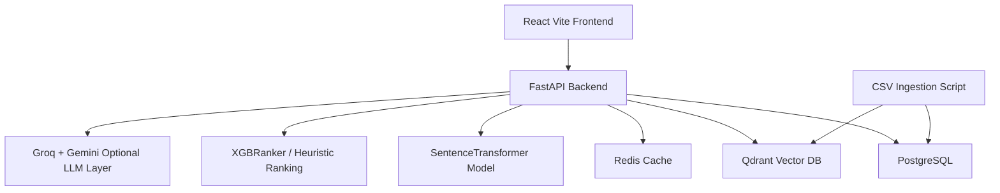
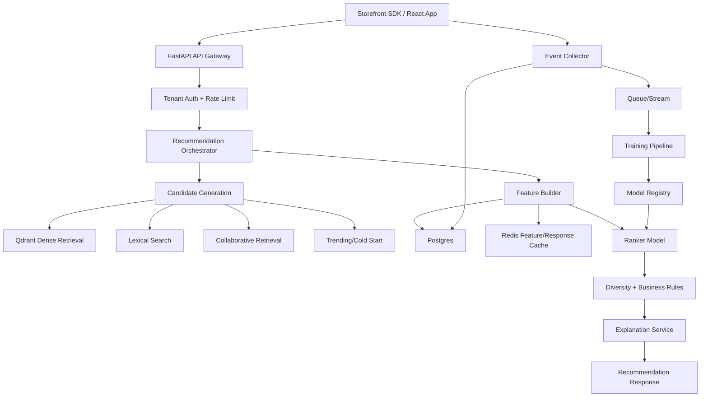

# EliteRec Advanced Project Analysis and Improvement Roadmap

This document is a deep technical analysis of the current EliteRec product recommendation project and a point-wise roadmap for making it more advanced, production-ready, scalable, and commercially viable as a recommendation SaaS platform.

The project currently has two major layers:

1. A production-style service in `recommender_platform/` using FastAPI, Postgres, Qdrant, Redis, React, SBERT, XGBoost ranking structure, MMR reranking, and optional LLM enrichment.
2. A prototype/research pipeline at the repository root using Pandas, FAISS, TF-IDF, SBERT, NMF collaborative filtering, synthetic interaction simulation, offline evaluation metrics, and artifact persistence.

The strongest path forward is to merge the best ideas from the prototype layer into the production service layer, while hardening APIs, data contracts, ML training, observability, deployment, and tenant isolation.

---

## 1. Executive Summary

EliteRec is already a strong foundation for a hybrid product recommendation system. It has a modern service architecture, a working storefront, vector retrieval, ranking hooks, event collection logic, Redis caching, and a clear Docker-based local environment.

The platform is not yet fully advanced because the production service does not yet use all available recommendation signals, does not have an automated training lifecycle, does not have multi-tenant isolation, lacks migrations and test coverage, and has a few integration gaps that can affect real-time personalization.

The most important near-term improvements are:

1. Register the event router in the FastAPI app so frontend event tracking actually reaches the backend.
2. Initialize `HybridEngine` and `XGBRanker` into `app.state` at FastAPI startup so recommendation routes can execute.
3. Add database migrations with Alembic instead of relying on `metadata.create_all`.
4. Build a production training pipeline that trains ranking and collaborative models from stored interactions.
5. Add multi-tenant schema and cache isolation before positioning this as SaaS.
6. Add explicit service health checks for Postgres, Redis, Qdrant, model loading, and LLM availability.
7. Move from heuristic ranking toward learned ranking with offline and online evaluation.
8. Add tests for API routes, ingestion, recommender behavior, cache behavior, and frontend integration.
9. Add observability: metrics, structured logs, tracing, model quality reports, and fallback counters.
10. Improve frontend event coverage beyond click events: view impressions, add-to-cart, purchase, dwell time, search query events, and recommendation slot exposure.
11. Introduce an ML lifecycle: artifact registry, versioned models, reproducible training, model rollback, and A/B testing.

---

## 2. Current Architecture

### 2.1 Production Service Architecture

The production-style app lives in `recommender_platform/`.



Main components:

- `recommender_platform/app/main.py`: creates the FastAPI app, configures CORS, creates DB tables, and registers routers.
- `recommender_platform/app/api/recommendations.py`: exposes recommendation routes.
- `recommender_platform/app/api/items.py`: exposes product search/listing routes.
- `recommender_platform/app/api/users.py`: exposes user creation and history routes.
- `recommender_platform/app/api/events.py`: defines event ingestion, but is not currently registered in `main.py`.
- `recommender_platform/app/services/recommender.py`: orchestrates retrieval, ranking, MMR, LLM reranking, and explanation generation.
- `recommender_platform/app/ml/engine/hybrid.py`: handles SBERT embeddings, Qdrant vector retrieval, and MMR reranking.
- `recommender_platform/app/ml/ranking/ranker.py`: defines an `XGBRanker` wrapper and a heuristic ranking fallback.
- `recommender_platform/scripts/ingest_data.py`: ingests CSV rows into Postgres and Qdrant.
- `recommender_platform/frontend-react/src/App.jsx`: storefront interface, search UI, recommendation display, and click tracking.

### 2.2 Prototype and Research Architecture

The repository root contains an older but more experimental recommendation stack.

Important files:

- `app.py`: Gradio application with SBERT, TF-IDF, FAISS, metadata scoring, ensemble ranking, and MMR.
- `hybrid_recommender.py`: combines content scoring, collaborative filtering, popularity, recency, and MMR.
- `collaborative_filtering.py`: NMF-based collaborative filtering over implicit interactions.
- `interaction_simulator.py`: synthetic user interaction generator.
- `evaluation.py`: offline ranking metrics such as Precision@K, Recall@K, nDCG@K, and MRR.
- `persistence.py`: artifact persistence for FAISS, TF-IDF, embeddings, and generic objects.
- `run_pipeline.py`: end-to-end offline experiment pipeline.
- `universal_wrapper.py`: schema mapping layer that can adapt arbitrary datasets into the recommender format.

This prototype layer contains several advanced ideas that should be migrated into the production service carefully.

---

## 3. Current Recommendation Flow

### 3.1 Personalized Recommendation Flow

Current production route:

```text
GET /api/v1/recommend/user/{user_id}?limit=10
```

Current flow:

1. Check Redis using key `recs:user:{user_id}:limit:{limit}`.
2. If cached, return cached response.
3. Find user by `external_id`.
4. If user does not exist, return trending recommendations.
5. Fetch the user's 10 most recent interacted items.
6. If there is no history, return trending recommendations.
7. Convert recent item titles into embeddings using SentenceTransformers.
8. Mean-pool recent item vectors into one user vector.
9. Query Qdrant `products` collection for 50 candidate products.
10. Build features from retrieval score, price, category, stars, and popularity.
11. Rank with XGBoost if possible; otherwise use a weighted heuristic.
12. Apply MMR diversity reranking for candidates that include vectors.
13. Optionally rerank with Groq if `USE_LLM_RERANKING=true` and `GROQ_API_KEY` is present.
14. Normalize response fields.
15. Optionally generate Gemini explanations for the top 3 items.
16. Write the response to Redis for 60 seconds.

### 3.2 Similar Item Flow

Current route:

```text
GET /api/v1/recommend/item/{asin}?limit=10
```

Current flow:

1. Look up item in Postgres by ASIN.
2. Embed the item title.
3. Query Qdrant for nearest neighbors.
4. Normalize response fields.
5. Return `content_similarity` strategy.

### 3.3 Trending Flow

Current route:

```text
GET /api/v1/recommend/trending?limit=10
```

Current scoring formula:

```text
0.55 * ln(bought_in_last_month + 1)
+ 0.25 * stars
+ 0.15 * ln(reviews + 1)
+ 0.05 * best_seller_flag
```

This is a sensible first version, but it is not time-windowed and does not yet use interaction events, inventory, margin, freshness, or category-level business rules.

### 3.4 Bundle Flow

Current route:

```text
GET /api/v1/recommend/bundle/{asin}?limit=5
```

Current behavior:

1. Reuse similar-item retrieval.
2. Sort toward best sellers.
3. Return `bundle_v1_best_seller_filtered`.

This is a placeholder. True bundle recommendations require co-purchase, co-cart, co-view, session graph, or basket association logic.

---

## 4. Module-by-Module Analysis

### 4.1 Backend API

Strengths:

1. FastAPI is a good fit for a recommendation API.
2. Routes are separated by domain: users, items, recommendations, and events.
3. Pydantic schemas exist for recommendation responses.
4. Query limits use validation in multiple routes.
5. The service uses dependency injection for DB sessions.

Gaps:

1. `events.py` defines `POST /events`, but `main.py` does not register the events router. The frontend posts to `/api/v1/events`, so event tracking can fail unless this is fixed.
2. Recommendation routes depend on `request.app.state.engine` and `request.app.state.ranker`, but `main.py` does not currently initialize these objects.
3. API routes have no authentication or API keys.
4. There is no tenant isolation.
5. There is no request ID, correlation ID, or structured logging.
6. There is no rate limiting.
7. There is no API versioning beyond the path prefix.
8. Error responses are not standardized.
9. There is no pagination metadata for item listing.
10. There is no route for ingestion through the API.
11. There is no admin route for model status, index status, or cache status.

Recommended improvements:

1. Register the events router:
   ```python
   from .api import recommendations, users, items, events
   app.include_router(events.router, prefix="/api/v1", tags=["events"])
   ```
2. Initialize ML components at app startup:
   ```python
   from .ml.engine.hybrid import HybridEngine
   from .ml.ranking.ranker import XGBRanker

   @app.on_event("startup")
   def load_models():
       app.state.engine = HybridEngine()
       app.state.ranker = XGBRanker(model_path=settings.RANKER_MODEL_PATH)
   ```
3. Add API key or JWT authentication for clients.
4. Add tenant-aware routes:
   ```text
   /api/v1/tenants/{tenant_id}/recommend/user/{user_id}
   ```
5. Add standardized error schema.
6. Add middleware for request IDs and structured logs.
7. Add health endpoints:
   ```text
   GET /health/live
   GET /health/ready
   GET /health/dependencies
   GET /api/v1/admin/model-status
   ```
8. Add rate limiting with Redis.
9. Add endpoint-level metrics for latency, cache hit rate, and error rate.

### 4.2 Database Layer

Strengths:

1. SQLAlchemy models are simple and easy to understand.
2. Core entities are present: users, items, and interactions.
3. Item model contains useful ranking fields: price, stars, reviews, best-seller flag, and purchase popularity proxy.
4. Relationships are defined between users, items, and interactions.

Gaps:

1. No Alembic migrations.
2. No `tenant_id`.
3. No unique constraint to prevent accidental duplicate event ingestion when clients retry.
4. No interaction weight column.
5. No event metadata fields such as session ID, device, source page, recommendation request ID, rank position, or experiment variant.
6. No product availability/inventory field.
7. No item status field such as active, deleted, out of stock, or hidden.
8. No created/updated timestamps for items.
9. No category normalization table.
10. No model artifact/version metadata table.

Recommended schema improvements:

1. Add Alembic migrations immediately.
2. Add `tenant_id` to all business tables.
3. Add `created_at` and `updated_at` to all entities.
4. Extend interactions:
   ```text
   tenant_id
   external_event_id
   session_id
   interaction_type
   weight
   rank_position
   recommendation_request_id
   source
   device_type
   timestamp
   metadata_json
   ```
5. Extend items:
   ```text
   tenant_id
   sku
   brand
   normalized_category_id
   stock_status
   inventory_count
   margin
   currency
   created_at
   updated_at
   indexed_at
   ```
6. Add model metadata:
   ```text
   model_versions
   training_runs
   evaluation_reports
   experiment_assignments
   ```

### 4.3 Vector Search Layer

Strengths:

1. Qdrant is a strong production vector database choice.
2. Ingestion uses deterministic point IDs from ASINs.
3. Qdrant payloads include product metadata.
4. Query results return payloads, scores, and vectors.
5. MMR can use returned candidate vectors directly.

Gaps:

1. Qdrant collection name is hardcoded as `products`.
2. No tenant-level filtering.
3. No index versioning.
4. No vector model version stored in payload.
5. No hybrid lexical/vector retrieval in production service.
6. No payload filters for category, price range, availability, brand, or tenant.
7. No retry/backoff logic for Qdrant failures.
8. No warmup or readiness check.

Recommended improvements:

1. Add vector collection config to settings.
2. Add payload fields:
   ```text
   tenant_id
   model_name
   embedding_version
   indexed_at
   active
   category
   price
   brand
   stock_status
   ```
3. Use Qdrant payload filters for tenant and active inventory.
4. Add hybrid retrieval:
   - Dense vector retrieval with SBERT.
   - Lexical retrieval with Postgres full-text search, BM25, OpenSearch, or Qdrant sparse vectors.
   - Merge candidates with reciprocal rank fusion.
5. Add index rebuild workflow:
   - Build new collection or namespace.
   - Validate counts and sample queries.
   - Flip alias to new collection.
   - Keep old version for rollback.

### 4.4 Ranking Layer

Strengths:

1. Ranking is separated from retrieval.
2. XGBoost ranker wrapper exists.
3. Feature engineering already includes similarity, price, stars, category match, and user preference match.
4. The service degrades to a heuristic when the model is not fitted.

Gaps:

1. The XGBoost model is not trained in production.
2. There is no model artifact loading path configured at API startup.
3. Feature names are not versioned.
4. Training data generation is not connected to Postgres interactions.
5. No label generation strategy exists for ranking training.
6. No offline evaluation gate exists before deploying a model.
7. No model explainability beyond basic score fields.
8. No A/B testing or champion/challenger routing.

Recommended improvements:

1. Create `app/ml/training/ranker_training.py`.
2. Build labels from interaction weights:
   ```text
   view = 1
   click = 2
   add_to_cart = 3
   purchase = 5
   return/refund = negative signal
   ```
3. Train query groups based on user sessions, user histories, or seed items.
4. Store feature definitions in a versioned object.
5. Save model artifacts to `models/ranker/{version}/model.json`.
6. Load the configured model version at API startup.
7. Add feature drift checks.
8. Add offline metrics:
   - Precision@K
   - Recall@K
   - nDCG@K
   - MRR
   - MAP@K
   - coverage
   - diversity
   - novelty
   - calibration
9. Add online metrics:
   - CTR
   - add-to-cart rate
   - conversion rate
   - revenue per session
   - average order value
   - repeat purchase rate

### 4.5 Collaborative Filtering

Strengths:

1. The root prototype has an NMF collaborative filter.
2. It supports implicit interaction weights.
3. It produces user and item latent vectors.
4. It can score candidate items for a user.

Gaps:

1. It is not integrated into the production FastAPI service.
2. It uses numeric user IDs and item indices rather than production IDs.
3. It has no incremental update strategy.
4. It is trained from synthetic or local artifact interactions, not production Postgres.
5. Some comments mention LightFM, but the current code uses scikit-learn NMF.

Recommended improvements:

1. Migrate NMF collaborative filtering into `recommender_platform/app/ml/collaborative/`.
2. Train from `interactions` table.
3. Build stable mappings:
   ```text
   external_user_id -> internal_user_idx
   item_asin -> internal_item_idx
   ```
4. Store mappings with the model artifact.
5. Add fallback behavior for unknown users and unknown items.
6. Use collaborative scores as a reranking feature instead of direct retrieval initially.
7. Later evaluate alternatives:
   - ALS for implicit feedback.
   - LightFM or factorization machines.
   - Two-tower neural retrieval.
   - Graph-based recommendations from co-view/co-purchase edges.

### 4.6 LLM Layer

Strengths:

1. LLM functionality is optional and feature-gated by environment variables.
2. Groq reranking is isolated in `LLMService`.
3. Gemini explanations are isolated and have fallbacks.
4. Production recommendations work without LLM keys.

Gaps:

1. LLM reranking can add latency and cost without caching at the item/context level.
2. Prompt output parsing is fragile.
3. There is no timeout handling.
4. There is no circuit breaker.
5. No LLM observability exists: latency, error count, fallback count, cost estimate.
6. Explanations are generated sequentially for top 3 items.
7. The prompt asks Groq for JSON object format but says to return a JSON list; this mismatch can cause parsing issues.
8. No safety checks exist for explanation text.

Recommended improvements:

1. Add timeout and retry policy for LLM calls.
2. Fix Groq response contract:
   ```text
   Return {"asins": ["B001", "B002"]}
   ```
3. Cache explanations by:
   ```text
   tenant_id + user_interest_hash + asin + explanation_model_version
   ```
4. Generate explanations asynchronously or concurrently.
5. Add LLM fallback counters.
6. Add max latency budget:
   ```text
   Reranking only if candidate list is small and request is not latency-critical.
   ```
7. Consider moving LLM reranking offline for product enrichment, not every request.
8. Use LLMs for:
   - Product attribute extraction.
   - Category normalization.
   - Review summarization.
   - Explanation templates.
   - Query understanding.
   - Search reformulation.

### 4.7 Frontend

Strengths:

1. The frontend is modern and polished.
2. It shows personalized and trending sections.
3. Search is debounced.
4. It records click events.
5. It has product detail modals.
6. It uses Vite proxying for local API calls.

Gaps:

1. Event ingestion route is not registered in the backend currently.
2. Only clicks are tracked from product cards.
3. No recommendation impression events are tracked.
4. No add-to-cart or purchase events are wired.
5. No loading state for modal recommendations.
6. No per-section strategy/debug display for developers.
7. No mobile search input in the visible navigation.
8. No cart state despite showing an Add to Cart button.
9. No frontend tests.
10. `App.css` appears to retain unused Vite starter styles.

Recommended improvements:

1. Track impressions when recommendation cards appear in viewport.
2. Track:
   ```text
   product_view
   recommendation_impression
   recommendation_click
   add_to_cart
   purchase
   search_query
   search_result_click
   ```
3. Include metadata in events:
   ```text
   recommendation_request_id
   rank_position
   strategy
   section
   query
   session_id
   ```
4. Implement cart behavior and purchase simulation.
5. Add a user debug panel:
   - user ID
   - recent history
   - active strategy
   - cache state
   - top score components
6. Improve empty states:
   - cold-start recommendations
   - search no-results suggestions
   - backend unavailable state
7. Remove unused starter CSS.
8. Add Playwright end-to-end tests for:
   - homepage load
   - search
   - product modal
   - click event POST
   - recommendation refresh after interactions

### 4.8 Ingestion

Strengths:

1. Ingestion is streaming/chunked.
2. It cleans input values.
3. It skips invalid rows.
4. It upserts into Postgres by ASIN.
5. It upserts into Qdrant with deterministic IDs.
6. It supports configurable batch size and sample size.

Gaps:

1. Ingestion is CLI-only.
2. No tenant support.
3. No ingestion job table.
4. No validation report is stored.
5. No dead-letter path for bad rows.
6. No progress API.
7. No idempotency key for ingestion jobs.
8. No support for deletes or deactivations.
9. No support for incremental updates from external systems.

Recommended improvements:

1. Add `/api/v1/ingest/jobs`.
2. Add async background processing with Celery, RQ, Dramatiq, or FastAPI background tasks initially.
3. Store ingestion job metadata:
   ```text
   tenant_id
   job_id
   status
   total_rows
   valid_rows
   invalid_rows
   started_at
   finished_at
   error_summary
   source_file
   schema_mapping
   ```
4. Add row-level validation results.
5. Add support for:
   - CSV upload
   - JSON lines
   - Parquet
   - S3/GCS URLs
   - Shopify export
   - WooCommerce export
6. Add incremental sync:
   - upsert item
   - deactivate item
   - reindex changed item
   - rebuild tenant index

### 4.9 Evaluation

Strengths:

1. Offline metrics exist in root `evaluation.py`.
2. Production folder has a smaller metrics module.
3. The prototype compares baseline and hybrid recommenders.
4. Metrics include Precision@K, Recall@K, nDCG@K, and MRR.

Gaps:

1. Evaluation is not part of CI.
2. Evaluation is not connected to production training.
3. No dataset split policy is defined for production interactions.
4. No model promotion gate exists.
5. No online experimentation system exists.
6. No business metrics are tracked.

Recommended improvements:

1. Move evaluation into `recommender_platform/app/ml/evaluation/`.
2. Add a reproducible offline evaluation script.
3. Add chronological train/test split.
4. Add model comparison reports.
5. Add quality gates before model promotion:
   ```text
   nDCG@10 must improve or stay within tolerance.
   Coverage must not drop below threshold.
   Latency must stay within budget.
   Diversity must stay within threshold.
   ```
6. Add A/B testing:
   - experiment ID
   - user assignment
   - strategy version
   - impression logging
   - conversion attribution

### 4.10 DevOps and Deployment

Strengths:

1. Docker Compose defines Postgres, Qdrant, Redis, API, and frontend.
2. Makefile has common commands.
3. Dockerfile caches heavy Python dependencies before copying the app.
4. `.env.example` exists.

Gaps:

1. API runs with `--reload` in Docker, which is good for dev but not production.
2. No production Dockerfile target.
3. No CI pipeline.
4. No tests are currently enforced.
5. No security scanning.
6. No typed/lint checks for backend.
7. No deployment manifests for Kubernetes, ECS, Fly.io, Render, Railway, or similar.
8. No backup/restore workflow for Postgres or Qdrant.

Recommended improvements:

1. Add separate dev and prod Docker commands.
2. Add `gunicorn` or production `uvicorn` workers for deployment.
3. Add CI pipeline:
   ```text
   backend lint
   backend tests
   frontend lint
   frontend build
   docker build
   basic API smoke test
   ```
4. Add pre-commit hooks.
5. Add dependency lock strategy.
6. Add Docker health checks for services.
7. Add backup scripts:
   - Postgres dump
   - Qdrant snapshot
   - Redis not critical except session/cache if needed
8. Add environment-specific config:
   - local
   - staging
   - production

---

## 5. Critical Issues to Fix First

### 5.1 Event Router Is Not Registered

Current state:

- `recommender_platform/app/api/events.py` defines `POST /events`.
- `recommender_platform/app/main.py` imports and registers `recommendations`, `users`, and `items`.
- The events router is not included.
- The frontend posts to `${API_BASE}/events`.

Impact:

- Click events may not be stored.
- User history may not update from frontend usage.
- Personalized recommendations may stay stuck on trending for new users.

Recommended fix:

```python
from .api import recommendations, users, items, events

app.include_router(events.router, prefix="/api/v1", tags=["events"])
```

Priority: P0.

### 5.2 Recommender Engine and Ranker Are Not Initialized in App State

Current state:

- `recommendations.py` creates `RecommenderService` with `request.app.state.engine` and `request.app.state.ranker`.
- `main.py` does not currently set `app.state.engine` or `app.state.ranker`.
- `HybridEngine` and `XGBRanker` classes exist, but there is no visible startup wiring in the FastAPI app.

Impact:

- Recommendation endpoints can fail at runtime with missing app state attributes.
- The API may start successfully but fail only when a recommendation route is called.
- Docker health checks can pass while core recommendation functionality is broken.

Recommended fix:

```python
from .ml.engine.hybrid import HybridEngine
from .ml.ranking.ranker import XGBRanker

@app.on_event("startup")
def load_recommendation_components():
    app.state.engine = HybridEngine()
    app.state.ranker = XGBRanker()
```

Longer-term fix:

1. Add `RANKER_MODEL_PATH` to settings.
2. Load a trained ranker artifact when available.
3. Add readiness checks that verify `engine`, `ranker`, Qdrant, Postgres, and Redis.
4. Add an integration test that calls `/api/v1/recommend/trending` and `/api/v1/recommend/user/{user_id}`.

Priority: P0.

### 5.3 No Database Migrations

Current state:

- Tables are created with `models.Base.metadata.create_all(bind=engine)`.

Impact:

- Schema changes become risky.
- Production upgrades are difficult.
- Data migration is not controlled.

Recommended fix:

1. Add Alembic.
2. Generate an initial migration.
3. Remove direct table creation from request-serving app startup in production.

Priority: P0.

### 5.4 Ranker Is Not Actually Trained

Current state:

- `XGBRanker` is instantiated.
- If `predict` fails because the model is not fitted, the code falls back to heuristic scoring.

Impact:

- The platform sounds like it uses a learned ranker, but production behavior is mostly heuristic.
- Quality improvement is limited.

Recommended fix:

1. Add training script from real interactions.
2. Save model artifacts.
3. Load model path from settings.
4. Add evaluation before promotion.

Priority: P0/P1.

### 5.5 No Multi-Tenant Isolation

Current state:

- All users, items, interactions, cache keys, and Qdrant vectors are global.

Impact:

- Not safe for SaaS with multiple stores.
- Recommendations can leak across clients.

Recommended fix:

1. Add tenants table.
2. Add `tenant_id` to users, items, interactions.
3. Add tenant to cache keys.
4. Add Qdrant tenant payload filters or per-tenant collections.

Priority: P1 before SaaS launch.

### 5.6 Event Model Is Too Small for Learning

Current state:

- Event body only includes `user_id`, `asin`, and `type`.

Impact:

- The model cannot learn recommendation slot bias, search behavior, session patterns, or conversion attribution.

Recommended fix:

Add:

```text
session_id
request_id
section
rank_position
strategy
query
source_page
metadata
```

Priority: P1.

---

## 6. Advanced Recommendation Roadmap

### Phase 1: Stabilize the Current Platform

Goal: make the existing product actually reliable.

Point-wise actions:

1. Register the events router.
2. Add API tests for all routes.
3. Add a smoke test for Docker startup.
4. Add Alembic migrations.
5. Add structured logging.
6. Add readiness checks for Postgres, Redis, Qdrant, and model loading.
7. Add Redis error fallback so recommendation routes still work when Redis is down.
8. Add Qdrant error handling and clear 503 responses.
9. Add request validation for recommendation limits.
10. Add frontend build/lint checks to CI.

Expected outcome:

- Event tracking works.
- New users can build history.
- The local stack is more predictable.
- Future schema changes are manageable.

### Phase 2: Improve Ranking Quality

Goal: move from heuristic ranking to measurable ranking quality.

Point-wise actions:

1. Build feature store logic from Postgres interactions.
2. Add event weights.
3. Train XGBoost ranker from chronological user histories.
4. Add offline evaluation report generation.
5. Persist model artifacts.
6. Load model artifacts at API startup.
7. Add fallback to heuristic only when model artifact is missing or invalid.
8. Add model version to recommendation response.
9. Log features and scores for debugging.
10. Add quality dashboards.

Recommended ranking features:

1. Vector similarity score.
2. Category match.
3. Brand match.
4. Price distance.
5. Rating.
6. Review count.
7. Bought-in-last-month.
8. Best-seller flag.
9. User category affinity.
10. User brand affinity.
11. User price-band affinity.
12. Time since last interaction.
13. Interaction type count by category.
14. Collaborative filtering score.
15. Item freshness.
16. Inventory availability.
17. Margin or business priority.
18. Popularity within tenant.
19. Popularity within category.
20. Query/search match score.

Expected outcome:

- Recommendations become trainable, measurable, and improvable.

### Phase 3: Add Collaborative Filtering to Production

Goal: use collective behavior, not only content similarity.

Point-wise actions:

1. Move NMF collaborative filter into production package.
2. Train it from the `interactions` table.
3. Persist user/item mappings.
4. Add CF score as ranker feature.
5. Add fallback for unknown users.
6. Evaluate hybrid vs content-only.
7. Add daily retraining.
8. Add warm-start support for users with a few interactions.
9. Add item-item collaborative similarity for bundles.
10. Consider ALS or two-tower retrieval after enough data exists.

Expected outcome:

- The system can recommend items users may like even when product text similarity is not enough.

### Phase 4: Add Advanced Retrieval

Goal: retrieve better candidates before ranking.

Point-wise actions:

1. Add dense vector retrieval from Qdrant.
2. Add lexical retrieval from Postgres full-text search, BM25, or sparse vectors.
3. Add popularity retrieval for cold-start.
4. Add collaborative retrieval for known users.
5. Merge candidate sets with reciprocal rank fusion.
6. Deduplicate candidates.
7. Filter unavailable items.
8. Filter already-purchased items where appropriate.
9. Add category-aware retrieval.
10. Add query-aware retrieval for search/recommendation fusion.

Candidate sources:

```text
dense_content_candidates
lexical_candidates
collaborative_candidates
trending_candidates
recently_viewed_category_candidates
bundle_graph_candidates
business_boost_candidates
```

Expected outcome:

- The ranker gets a richer and more diverse candidate pool.

### Phase 5: Build True SaaS Multi-Tenancy

Goal: make this safe for multiple stores.

Point-wise actions:

1. Add `tenants` table.
2. Add tenant-scoped API keys.
3. Add tenant ID to every user, item, and interaction.
4. Add tenant to Redis keys.
5. Add Qdrant payload filters or tenant-specific collections.
6. Add tenant-specific model versions.
7. Add tenant-specific ingestion jobs.
8. Add tenant-specific dashboards.
9. Add quotas and rate limits.
10. Add billing usage counters.

Tenant-aware cache keys:

```text
tenant:{tenant_id}:recs:user:{user_id}:limit:{limit}
tenant:{tenant_id}:recs:trending:limit:{limit}
tenant:{tenant_id}:explain:{hash}
```

Expected outcome:

- The project becomes structurally ready to become a SaaS product.

### Phase 6: Add Experimentation and Online Learning

Goal: measure what works with real users.

Point-wise actions:

1. Add recommendation request IDs.
2. Log every impression with strategy and rank position.
3. Log clicks, add-to-cart, purchases, and search interactions.
4. Add experiment assignment table.
5. Add strategy variants.
6. Add dashboard for CTR and conversion by strategy.
7. Add champion/challenger model rollout.
8. Add automatic rollback if metrics regress.
9. Add near-real-time feature updates for hot categories.
10. Add delayed attribution windows for purchase events.

Expected outcome:

- Model improvements are driven by evidence, not guesswork.

### Phase 7: Add Production Observability

Goal: make the system operable.

Point-wise actions:

1. Add Prometheus metrics.
2. Add OpenTelemetry tracing.
3. Add structured JSON logs.
4. Track per-route latency.
5. Track Redis cache hit rate.
6. Track Qdrant latency and error rate.
7. Track model scoring latency.
8. Track LLM calls, latency, errors, and fallbacks.
9. Track recommendation empty-result rate.
10. Track ingestion row throughput and invalid row rate.

Recommended metrics:

```text
recommendation_requests_total
recommendation_latency_ms
recommendation_cache_hit_total
recommendation_cache_miss_total
qdrant_query_latency_ms
ranker_predict_latency_ms
llm_rerank_latency_ms
llm_explanation_latency_ms
fallback_to_trending_total
empty_recommendation_total
ingestion_rows_total
ingestion_invalid_rows_total
events_ingested_total
```

Expected outcome:

- Debugging and scaling decisions become much easier.

---

## 7. Advanced Product Features to Add

### 7.1 Store Owner Dashboard

Add a SaaS dashboard for store owners.

Point-wise features:

1. Upload catalogue.
2. Monitor ingestion jobs.
3. See top recommended products.
4. See click-through rate.
5. See conversion rate.
6. See top categories.
7. See cold-start product coverage.
8. Configure recommendation widgets.
9. Configure business rules.
10. View model quality reports.

### 7.2 Recommendation Widget SDK

Add embeddable client components.

Point-wise features:

1. JavaScript SDK.
2. React SDK.
3. Shopify script snippet.
4. WooCommerce plugin later.
5. Event tracking wrapper.
6. Recommendation carousel component.
7. Similar products component.
8. Frequently bought together component.
9. Personalized homepage component.
10. Search autocomplete component.

### 7.3 Business Rules Engine

Add merchant controls.

Point-wise features:

1. Boost products by brand.
2. Boost products by margin.
3. Exclude out-of-stock products.
4. Exclude already-purchased items.
5. Pin products in certain slots.
6. Promote seasonal collections.
7. Apply category constraints.
8. Apply price range constraints.
9. Add diversity constraints.
10. Add compliance/safety blocklists.

### 7.4 Better Explanations

Current explanations are Gemini-generated only for top 3, or frontend fallback text.

Better approach:

1. Build deterministic explanation templates from score features.
2. Use LLM only to polish or personalize.
3. Cache generated explanations.
4. Avoid explanations that mention unavailable data.
5. Include merchant-safe phrasing.
6. Expose explanation type:
   ```text
   similar_to_recent_view
   popular_in_category
   matches_price_preference
   high_rating
   frequently_bought_together
   ```

### 7.5 Advanced Search

The current search uses `ILIKE` over product title.

Recommended upgrades:

1. Add Postgres full-text search.
2. Add typo tolerance.
3. Add synonym expansion.
4. Add semantic search through Qdrant.
5. Add query suggestions.
6. Add facet filters.
7. Add category-aware ranking.
8. Add search result click tracking.
9. Add zero-result recovery.
10. Add search-to-recommendation personalization.

---

## 8. Suggested Target Architecture



Production services to consider:

1. API service.
2. Worker service for ingestion and training.
3. Event collector service.
4. Scheduler service.
5. Frontend/dashboard service.
6. Redis.
7. Postgres.
8. Qdrant.
9. Object storage for model artifacts.
10. Monitoring stack.

---

## 9. Recommended File and Package Reorganization

Current production code is compact. As the project grows, split it by responsibility.

Suggested structure:

```text
recommender_platform/
  app/
    api/
      routes/
        users.py
        items.py
        events.py
        recommendations.py
        ingest.py
        admin.py
      dependencies.py
      errors.py
    core/
      config.py
      logging.py
      security.py
      rate_limit.py
      cache.py
    db/
      models.py
      session.py
      repositories/
        users.py
        items.py
        interactions.py
        tenants.py
    ml/
      retrieval/
        dense.py
        lexical.py
        collaborative.py
        fusion.py
      ranking/
        features.py
        ranker.py
        model_loader.py
      diversity/
        mmr.py
        business_rules.py
      training/
        dataset.py
        train_ranker.py
        train_cf.py
        evaluate.py
      evaluation/
        metrics.py
        reports.py
      registry/
        artifacts.py
        metadata.py
    services/
      recommender.py
      ingestion.py
      event_collector.py
      explanation.py
      experiments.py
    schemas/
      users.py
      items.py
      events.py
      recommendations.py
      ingestion.py
    workers/
      tasks.py
      scheduler.py
  alembic/
  tests/
    unit/
    integration/
    e2e/
```

---

## 10. Testing Strategy

### 10.1 Backend Unit Tests

Point-wise tests:

1. Config loads defaults correctly.
2. Redis cache get/set handles valid JSON.
3. Redis failure does not crash recommendation route.
4. Ranker feature engineering handles missing fields.
5. MMR returns unique candidates.
6. MMR respects `top_k`.
7. Trending score sorts expected items first.
8. LLM service returns fallback on error.
9. Ingestion cleaning handles nulls and invalid rows.
10. Deterministic Qdrant point ID remains stable.

### 10.2 Backend Integration Tests

Point-wise tests:

1. Create user.
2. Ingest small fixture catalogue.
3. Search items.
4. Create event.
5. Fetch user history.
6. Fetch trending recommendations.
7. Fetch similar-item recommendations.
8. Fetch personalized recommendations after events.
9. Verify cache hit path.
10. Verify missing item returns 404.

### 10.3 Frontend Tests

Point-wise tests:

1. App loads.
2. Trending products render.
3. Personalized section renders.
4. Search results appear after typing.
5. Product modal opens.
6. Product modal closes with Escape.
7. Click event is sent.
8. Error banner appears when API is down.
9. User selector changes active user.
10. Add-to-cart event fires when implemented.

### 10.4 ML Evaluation Tests

Point-wise tests:

1. Precision@K handles empty lists.
2. Recall@K handles no ground truth.
3. nDCG@K returns 1 for perfect ranking.
4. MRR returns reciprocal first hit.
5. Training dataset builder creates valid groups.
6. Model artifact can save and reload.
7. Ranker predictions are deterministic for fixed input.
8. Offline evaluation report is generated.

---

## 11. Security and Privacy Improvements

Point-wise improvements:

1. Add tenant API keys.
2. Hash or pseudonymize external user IDs where possible.
3. Avoid storing unnecessary PII.
4. Add request body limits.
5. Add file upload size limits.
6. Validate CSV headers before ingestion.
7. Scan uploaded files.
8. Add CORS config from environment, not hardcoded local ports only.
9. Add rate limiting per tenant.
10. Add audit logs for admin actions.
11. Store secrets in environment/secret manager only.
12. Add dependency vulnerability scanning.
13. Add data retention policy for interactions.
14. Add tenant data export/delete workflow.
15. Add GDPR/CCPA-friendly deletion path if this becomes real SaaS.

---

## 12. Performance Improvements

Point-wise improvements:

1. Load SBERT model once at startup, not per request. The current design does this through app state if initialized properly.
2. Add startup warmup embeddings.
3. Batch Gemini explanations or generate concurrently.
4. Avoid returning vectors outside internal ranking logic.
5. Add Redis cache around expensive explanations.
6. Add query timeout for Qdrant.
7. Use async workers for ingestion and training.
8. Add DB indexes:
   ```text
   users.external_id
   items.asin
   items.category
   items.title
   interactions.user_id
   interactions.item_id
   interactions.timestamp
   interactions.user_id + timestamp
   tenant_id combinations after multi-tenancy
   ```
9. Add pagination metadata to item search.
10. Add connection pool tuning.
11. Add response compression if payloads grow.
12. Add CDN/object storage for product images if images are proxied later.

---

## 13. Data Quality Improvements

Point-wise improvements:

1. Normalize categories.
2. Deduplicate items by ASIN/SKU/title similarity.
3. Validate image URLs.
4. Validate product URLs.
5. Normalize currency.
6. Detect impossible prices.
7. Detect suspicious ratings.
8. Store missing field percentages per ingestion job.
9. Add text quality score for embeddings.
10. Add product language detection.
11. Generate product tags and attributes.
12. Add brand extraction.
13. Add taxonomy mapping.
14. Add item deactivation for stale products.

---

## 14. Model Quality Improvements

Point-wise improvements:

1. Add catalog coverage metric.
2. Add user coverage metric.
3. Add long-tail coverage metric.
4. Add novelty metric.
5. Add diversity metric by category and brand.
6. Add popularity bias metric.
7. Add cold-start user performance metric.
8. Add cold-start item exposure metric.
9. Add calibration by price band.
10. Add fairness/business constraints if required by tenant.
11. Add model drift detection.
12. Add embedding drift detection.
13. Add top-N sanity checks for important seed items.
14. Add regression tests with fixed fixture data.

---

## 15. API Contract Improvements

Recommended recommendation response shape:

```json
{
  "request_id": "rec_123",
  "tenant_id": "tenant_abc",
  "user_id": "USER_0",
  "strategy": "hybrid_v3",
  "model_version": "ranker_2026_06_06_001",
  "cached": false,
  "recommendations": [
    {
      "asin": "B001",
      "title": "Product title",
      "price": 19.99,
      "currency": "USD",
      "category": "Electronics",
      "rank": 1,
      "score": 0.82,
      "image_url": "https://example.com/image.jpg",
      "product_url": "https://example.com/product",
      "explanation_text": "Popular with shoppers who viewed similar headphones.",
      "explanation_type": "similar_to_recent_view",
      "debug": {
        "retrieval_source": "dense+cf",
        "ranking_score": 0.82,
        "diversity_adjustment": -0.03
      }
    }
  ]
}
```

Recommended event request shape:

```json
{
  "tenant_id": "tenant_abc",
  "user_id": "USER_0",
  "asin": "B001",
  "type": "recommendation_click",
  "session_id": "sess_123",
  "request_id": "rec_123",
  "rank_position": 1,
  "section": "picked_for_you",
  "strategy": "hybrid_v3",
  "timestamp": "2026-06-06T12:00:00Z",
  "metadata": {
    "page": "home",
    "query": null
  }
}
```

---

## 16. Suggested Implementation Order

### Week 1: Fix and Stabilize

1. Register events router.
2. Add API route tests.
3. Add Alembic initial migration.
4. Add Redis-safe fallbacks.
5. Add basic structured logging.
6. Add health readiness checks.
7. Clean unused frontend CSS.
8. Add frontend event tracking for Add to Cart.

### Week 2: Productionize Events

1. Expand event schema.
2. Add recommendation request IDs.
3. Log impressions.
4. Log search events.
5. Add event metadata.
6. Add event idempotency.
7. Add interaction weights.
8. Add user history debugging endpoint.

### Week 3: Trainable Ranking

1. Build training dataset from Postgres.
2. Add ranker training script.
3. Add evaluation script.
4. Save model artifacts.
5. Load model from settings.
6. Add model version to responses.
7. Add fallback counters.

### Week 4: Hybrid Retrieval and CF

1. Migrate NMF collaborative model into production package.
2. Train CF from Postgres interactions.
3. Add CF score as ranker feature.
4. Add lexical retrieval.
5. Add reciprocal rank fusion.
6. Evaluate quality lift.

### Week 5: SaaS Foundation

1. Add tenants table.
2. Add tenant-scoped API keys.
3. Add tenant IDs to models.
4. Add tenant-scoped cache keys.
5. Add Qdrant tenant filters.
6. Add ingestion jobs by tenant.

### Week 6: Observability and Experimentation

1. Add metrics.
2. Add tracing.
3. Add model quality reports.
4. Add A/B experiment assignment.
5. Add online metrics dashboard.
6. Add strategy rollout controls.

---

## 17. Advanced System Capabilities to Aim For

Point-wise target capabilities:

1. Personalized homepage recommendations.
2. Similar products.
3. Frequently bought together.
4. Cart completion recommendations.
5. Search result personalization.
6. Recently viewed continuation.
7. New arrival recommendations.
8. Trending by category.
9. Personalized deals.
10. Email campaign recommendations.
11. Cross-sell recommendations.
12. Upsell recommendations.
13. Session-based anonymous recommendations.
14. User cold-start onboarding.
15. Item cold-start boosting.
16. Merchant business rules.
17. Explanation generation.
18. A/B testing.
19. Real-time event ingestion.
20. Offline model retraining.
21. Multi-tenant SaaS isolation.
22. SDK/widget integration.
23. Admin dashboard.
24. Monitoring and alerting.
25. Model registry and rollback.

---

## 18. Conclusion

EliteRec is a promising hybrid recommendation platform with a good foundation. The production service already has the right broad architecture: API, relational store, vector store, cache, frontend, and model orchestration. The root prototype adds valuable advanced recommendation ideas: TF-IDF, FAISS, NMF collaborative filtering, offline evaluation, synthetic interaction simulation, universal schema mapping, and artifact persistence.

The best next move is not to rewrite everything. The best next move is to:

1. Fix the current integration gaps.
2. Add migrations and tests.
3. Turn event collection into a reliable learning signal.
4. Train and load real models.
5. Merge collaborative filtering and evaluation into the production service.
6. Add multi-tenant isolation.
7. Add observability, experimentation, and a SaaS dashboard.

If implemented in this order, the project can evolve from a strong demo into a genuinely advanced recommendation system and eventually a recommendation SaaS platform.
