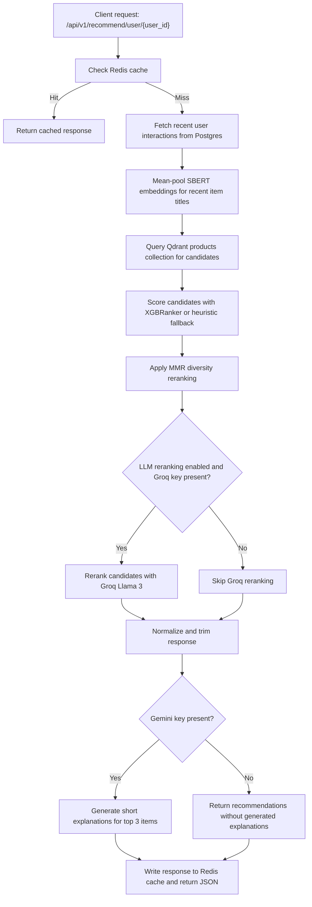

# EliteRec SaaS Platform: Project Architecture and Roadmap

This document is a handoff guide for the EliteRec product recommendation platform. It summarizes how the system is organized, how recommendations flow through the backend, how the React storefront interacts with the API, and where the next engineering work can build on the current implementation.

## 1. System Overview

EliteRec is a Dockerized recommendation platform with a FastAPI backend, PostgreSQL catalogue and interaction storage, Qdrant vector retrieval, Redis caching, a React storefront, and optional LLM-powered reranking and explanations.



### Infrastructure

- Backend API: FastAPI app in `recommender_platform/app`.
- Relational database: PostgreSQL, storing users, items, and interactions.
- Vector database: Qdrant, storing SBERT embeddings in the `products` collection.
- Cache: Redis, used for user and trending recommendation responses.
- Frontend: React, Vite, Tailwind CSS, Framer Motion, Axios, and Lucide icons.
- ML and ranking: SentenceTransformers, Qdrant nearest-neighbor retrieval, XGBoost ranker structure with heuristic fallback, and Maximal Marginal Relevance.
- Optional LLM layer: Groq for candidate reranking and Gemini 1.5 Flash for short recommendation explanations.

## 2. Repository Layout

```text
recommender_platform/
  app/
    main.py                    FastAPI app setup, CORS, table creation, routers
    api/
      users.py                 External user registration and lookup routes
      items.py                 Catalogue listing and search routes
      events.py                View, click, and purchase event ingestion
      recommendations.py       Personalized, similar-item, trending, and bundle routes
    core/
      config.py                pydantic-settings configuration
      cache.py                 Redis JSON get/set helpers
    db/
      models.py                SQLAlchemy User, Item, and Interaction models
      session.py               SQLAlchemy engine/session setup
    ml/
      engine/hybrid.py         SBERT embeddings, Qdrant retrieval, MMR utilities
      ranking/ranker.py        XGBRanker feature engineering and ranking fallback
      evaluation/metrics.py    Evaluation utilities
      training/                Placeholder package for future training workflows
    schemas/
      recommendation.py        Pydantic response schema
    services/
      recommender.py           Main recommendation orchestration service
      llm.py                   Groq and Gemini integration
    frontend.py                Gradio-style/admin testing surface
  frontend-react/
    src/App.jsx                Main storefront UI and event tracking
    vite.config.js             Vite dev server and API proxy config
  scripts/
    ingest_data.py             CSV ingestion into Postgres and Qdrant
    seed_interactions.py       Synthetic interaction seeding helper
    docker-teardown.sh         Local Docker cleanup helper
  data/
    amz_uk_processed_data.csv  Mounted product dataset for Docker ingestion
  docker-compose.yml           Postgres, Qdrant, Redis, API, and frontend services
  Dockerfile                   API image build
  Makefile                     Local workflow commands
```

The repository root also contains older standalone recommendation scripts and artifacts, including `app.py`, `hybrid_recommender.py`, `collaborative_filtering.py`, `universal_wrapper.py`, and serialized product embedding artifacts. The production-style service is currently centered in `recommender_platform/`.

## 3. Backend API Surface

The FastAPI app registers these main route groups:

- `GET /health`: simple health check.
- `GET /`: root welcome response.
- `/api/v1/users`: user registration and management.
- `/api/v1/items`: product catalogue pagination and search.
- `/api/v1/recommend`: recommendation routes.

Current recommendation endpoints:

- `GET /api/v1/recommend/user/{user_id}?limit=10`: personalized recommendations. Uses Redis key `recs:user:{user_id}:limit:{limit}` with a 60-second TTL.
- `GET /api/v1/recommend/item/{asin}?limit=10`: similar items by content/vector similarity.
- `GET /api/v1/recommend/trending?limit=10`: global trending recommendations. Uses Redis key `recs:trending:limit:{limit}` with `CACHE_TTL`.
- `GET /api/v1/recommend/bundle/{asin}?limit=5`: bundle-style recommendations using similar items, currently biased toward best sellers.

The app allows local Vite origins on ports `5173` through `5177` for browser development.

## 4. Data Model

The active SQLAlchemy models are:

- `User`: stored in `rec_users`, with a unique `external_id` supplied by the client system.
- `Item`: stored in `items`, keyed by unique `asin`; includes title, category, price, stars, reviews, bought-in-last-month count, best-seller flag, product URL, description, and image URL.
- `Interaction`: stored in `interactions`; links a user and item with an interaction type such as `view`, `click`, or `purchase`, plus optional rating and timestamp.

There is no tenant isolation yet. All users, items, interactions, and Qdrant points currently share the same logical catalogue.

## 5. Recommendation Pipeline

### Personalized Recommendations

`RecommenderService.get_personalized_recs` orchestrates the main flow:

1. Look up the external user ID in Postgres.
2. Fall back to trending recommendations when the user is missing or has no history.
3. Load the user's 10 most recent interacted items.
4. Encode their titles with SentenceTransformers and mean-pool them into a single user vector.
5. Query Qdrant for up to 50 candidate products from the `products` collection.
6. Build ranking features using candidate similarity score, price difference, stars, popularity score, category match, and user preference category match.
7. Score with `XGBRanker.predict` when a fitted model is available; otherwise use the current weighted heuristic fallback.
8. Apply MMR to diversify results that include Qdrant vectors.
9. Optionally rerank with Groq when `USE_LLM_RERANKING=true` and `GROQ_API_KEY` is configured.
10. Normalize response fields required by the frontend/schema.
11. Optionally generate Gemini explanations for the top three items when `GEMINI_API_KEY` is configured.

The response strategy is `llm_enhanced_hybrid` when LLM reranking is enabled, otherwise `xgboost_ranked_hybrid`.

### Similar Items

`get_similar_items` looks up a seed item by ASIN, embeds its title, queries Qdrant, normalizes fields, and returns a `content_similarity` response.

### Trending Items

`get_trending` computes a Postgres-side score from bought-in-last-month, stars, reviews, and best-seller status:

```text
0.55 * ln(bought_in_last_month + 1)
+ 0.25 * stars
+ 0.15 * ln(reviews + 1)
+ 0.05 * best_seller_flag
```

### Bundles

`get_bundles` currently reuses similar-item retrieval at a wider limit, then sorts toward best sellers. This is a placeholder until co-purchase or session sequence data is available.

## 6. Ingestion

`scripts/ingest_data.py` streams the Amazon UK processed CSV in chunks, cleans rows, filters out invalid products, and upserts data into both Postgres and Qdrant.

Key behavior:

- Default CSV path in Docker: `/app/data/amz_uk_processed_data.csv`.
- Default sample size: `INGEST_SAMPLE_SIZE`, currently `25000`.
- Default embedding model: `all-MiniLM-L6-v2`.
- Qdrant collection: `products`.
- Point IDs: deterministic MD5-derived integer IDs from ASINs, so re-ingestion is stable.
- `--reset`: recreates the Qdrant collection before ingesting.
- Postgres item writes use `ON CONFLICT` upserts keyed by ASIN.

Typical Docker-oriented run:

```bash
docker compose -f recommender_platform/docker-compose.yml up -d db qdrant redis api
docker compose -f recommender_platform/docker-compose.yml exec api python scripts/ingest_data.py --reset
```

## 7. Frontend

The React app in `frontend-react/src/App.jsx` provides a premium storefront-style test interface.

Current behaviors:

- Persists the active demo user in `localStorage` as `eliterec.user`.
- Ensures the selected external user exists by posting to `/api/v1/users`.
- Fetches personalized recommendations and trending items in parallel.
- Searches catalogue items through the API.
- Tracks product clicks by posting interaction events.
- Shows product details in a modal.
- Uses Vite's dev proxy in development, with `VITE_API_BASE` available for custom/prod API targets.

The Docker Compose frontend service runs Vite on port `5173` by default.

## 8. Configuration

Primary settings live in `app/core/config.py` and are loaded from `.env` when present.

Important variables:

- `DATABASE_URL`, or `POSTGRES_USER`, `POSTGRES_PASSWORD`, `POSTGRES_DB`, `POSTGRES_HOST`, `POSTGRES_PORT`
- `QDRANT_HOST`, `QDRANT_PORT`
- `REDIS_HOST`, `REDIS_PORT`
- `SBERT_MODEL`
- `INGEST_SAMPLE_SIZE`
- `INGEST_BATCH_SIZE`
- `CACHE_TTL`
- `GROQ_API_KEY`
- `GEMINI_API_KEY`
- `USE_LLM_RERANKING`
- `VITE_API_BASE` for the React frontend

## 9. Local Runbook

Start the full local cluster:

```bash
docker compose -f recommender_platform/docker-compose.yml up -d
```

Useful URLs:

- API: `http://127.0.0.1:8000`
- Health: `http://127.0.0.1:8000/health`
- Swagger docs: `http://127.0.0.1:8000/docs`
- Frontend: `http://127.0.0.1:5173`
- Qdrant dashboard/API: `http://127.0.0.1:6333`

If the catalogue is empty, run ingestion from the API container after the backend dependencies are up:

```bash
docker compose -f recommender_platform/docker-compose.yml exec api python scripts/ingest_data.py --reset
```

To seed interactions for demo personalization, use:

```bash
docker compose -f recommender_platform/docker-compose.yml exec api python scripts/seed_interactions.py
```

## 10. Current Strengths

- The platform is fully containerized with API, frontend, Postgres, Qdrant, and Redis services.
- Product ingestion updates both relational and vector stores in one script.
- Personalized recommendations degrade gracefully to trending when user history is unavailable.
- Candidate retrieval, rank scoring, diversity filtering, and optional LLM enrichment are separated into clear modules.
- The frontend records interaction events, letting demo user behavior change recommendations over time.
- Optional Groq and Gemini integrations are feature-gated by environment configuration.

## 11. Roadmap

### Automated Ranking Training

The ranker has an `XGBRanker` structure but no production training loop. Add a scheduled job or worker that reads interactions, builds grouped ranking data, trains/evaluates the model, saves model artifacts, and loads the latest approved model at API startup.

### API-First Dataset Ingestion

The current ingestion workflow is CLI and CSV-mounted. Add `/api/v1/ingest` endpoints for SaaS-style catalogue ingestion, supporting CSV upload, streaming JSON payloads, and eventually Parquet.

### Multi-Tenant Isolation

Introduce `tenant_id` across users, items, interactions, cache keys, API routes, and Qdrant payload filtering or per-tenant collections. This is the key architectural step for commercial SaaS usage.

### Better Bundle Logic

Replace the current similar-item best-seller heuristic with co-purchase, session sequence, or basket-level models once enough interaction data exists.

### Evaluation and Observability

Expand the evaluation module and add operational metrics for recall, click-through rate, cache hit rate, request latency, Qdrant latency, LLM fallback rate, and ingestion throughput.

### Client SDKs

Create JavaScript/TypeScript and React Native wrappers for user registration, event tracking, and recommendation retrieval to make storefront integration simpler for external clients.
